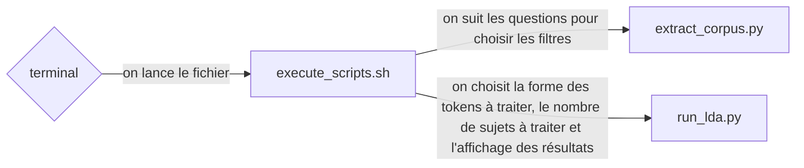
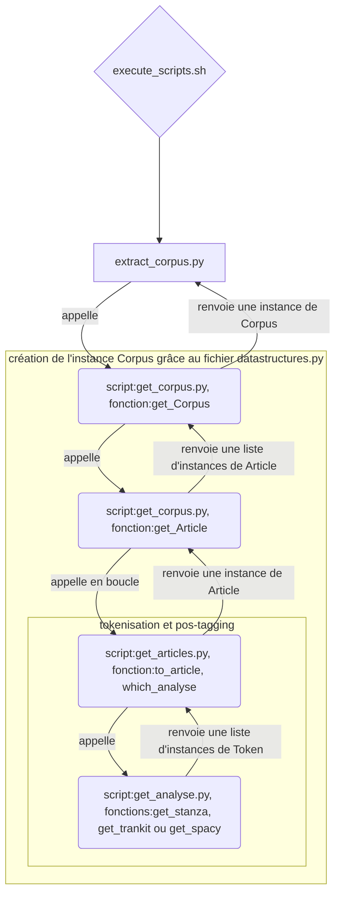
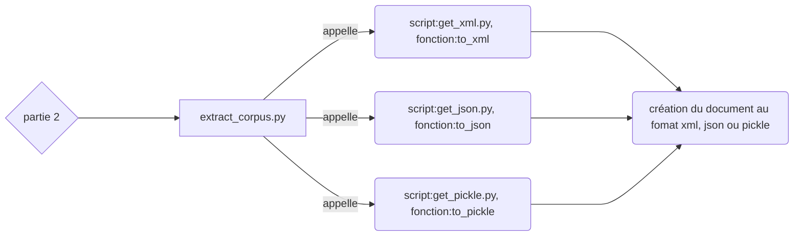
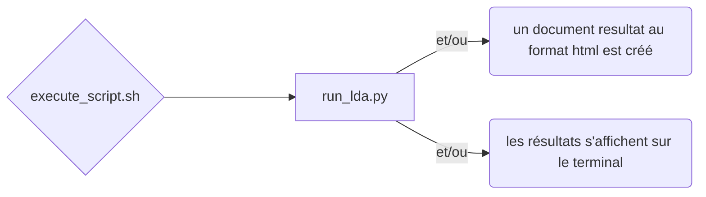
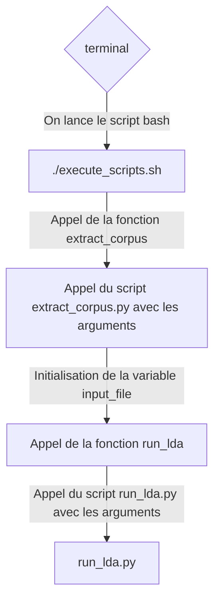

# Programmation et Projet Encadré 2

Objectif : Repérer les sujets et les expressions qui ont fait l’actualité en 2022 dans les publications de Le Monde

 

## I. Les scripts

### A. Comment les scripts s'appellent les uns les autres

#### partie 1 : filtres et choix données

#### partie 2 : script `extract_corpus.py` - extraction du sous-corpus

#### partie 3 : suite du script `extract_corpus.py` - création du fichier selon le format de sortie

#### partie 4 : script `run_lda.py` - topic modeling

### B. explication des scripts et des arguments à donner à chacun

#### 1. extract_corpus.py : [lien](https://github.com/Araule/M1S2_projetLauraCamilleShami/blob/main/scripts/extract_corpus.py "vers le script extract_corpus.py") 

##### les arguments

| informations          | arguments optionnels                       | arguments obligatoires | argument par défaut |
|-----------------------|--------------------------------------------|------------------------|---------------------|
| début                 | `-s 2022-XX-XX`                            |                        | 2022-01-01          |
| fin                   | `-e 2022-XX-XX`                            |                        | 2022-12-31          |
| choix de l'analyse    | `-m spacy ou trankit ou stanza`            |                        | spacy               |
| format de sortie      | `-f xml ou json ou pickle`                 |                        | xml                 |
| chemin vers le corpus |                                            |exemple: `~/Documents/PPE2-lauracamilleshami/corpus/2022/` | |
| catégories            | exemple : `une international sport planete` |                        | toutes les catégories |

##### les fonctions qui sont appelées par ce script
- la fonction `get_Corpus()` du script `get_corpus.py`
- la fonction `to_xml()` du script `get_xml.py`
- la fonction `to_json()` du script `get_json.py`
- la fonction `to_pickle()` du script `get_pickle.py`

##### sortie
- un document structuré xml, json ou pickle est créé

---

#### 2. get_corpus.py : [lien](https://github.com/Araule/M1S2_projetLauraCamilleShami/blob/main/scripts/get_corpus.py "vers le script get_corpus.py")

##### les fonctions qui sont appelées par un autre script
- `get_Corpus(fichiers:Path, nom_analyse: str, categories: Optional[List[str]]=None, begin: Optional[str]=None, end: Optional[str]=None)` : renvoie une instance de la classe `Corpus`

| nom du paramètre | type      | description                                           |
|------------------|-----------|-------------------------------------------------------|
| fichiers         | Path      | chemin vers le corpus                                 |
| nom_analyse      | str       | spacy ou trankit ou stanza                            |
| categories       | List[str] | liste des catégories choisies (optionnel)             |
| begin            | str       | début de la période choisie au format ISO (optionnel) |
| end              | str       | fin de la période choisie au format ISO (optionnel)   |

- `get_Article(chemins:Path, cat: List[str], start_date: str, end_date: str, nom_analyse: str)` : renvoie une liste d'instances de la classe `Article`; affiche également une barre de progression sur le terminal

| nom du paramètre | type      | description                               |
|------------------|-----------|-------------------------------------------|
| chemins          | Path      | chemin vers le corpus                     |
| cat              | List[str] | liste des catégories choisies             |
| start_date       | str       | début de la période choisie au format ISO |
| end_date         | str       | fin de la période choisie au format ISO   |
| nom_analyse      | str       | spacy, trankit ou stanza                  |

##### les fontions qui sont appelées par ce script
- la fonction `to_article` du script `get_articles.py`

---

#### 3. get_articles.py : [lien](https://github.com/Araule/M1S2_projetLauraCamilleShami/blob/main/scripts/get_articles.py "vers le script get_articles.py")

##### les fonctions qui sont appelées par un autre script
- `to_article(path, nom_analyse, nom_categorie, date)` : renvoie une instance de la classe `Article`

| nom du paramètre | type | description                |
|------------------|------|----------------------------|
| path             | Path | chemin vers le fichier     |
| nom_analyse      | str  | spacy ou trankit ou stanza |
| nom_categorie    | str  | catégorie choisie          |
| date             | str  | jour choisi au format ISO |

- `which_analyse(nom_analyse, desc)` : appelle l'une des fonctions qui analyse la description de l'article et renvoie une liste d'instances de la classe `Token`

| nom du paramètre | type | description                         |
|------------------|------|-------------------------------------|
| nom_analyse      | str  | spacy ou trankit ou stanza          |
| desc             | str  | description de l'article à analyser |

##### les fontions qui sont appelées par ce script
- la fonction `get_spacy(desc)` du script `get_analyse.py` ou
- la fonction `get_trankit(desc)` du script `get_analyse.py` ou
- la fonction `get_stanza(desc)` du script `get_analyse.py`

---

#### 4. get_analyse.py : [lien](https://github.com/Araule/M1S2_projetLauraCamilleShami/blob/main/scripts/get_analyse.py "vers le script get_analyse.py")

##### les fonctions qui sont appelées par un autre script
- `get_stanza(description)` : renvoie une liste d'instances de la classe `Token` analysées avec stanza

| nom du paramètre | type | description                         |
|------------------|------|-------------------------------------|
| description      | str  | description de l'article à analyser |

- `get_trankit(description)` : renvoie une liste d'instances de la classe `Token` analysées avec trankit

| nom du paramètre | type | description                         |
|------------------|------|-------------------------------------|
| description      | str  | description de l'article à analyser |

- `get_spacy(description)` : renvoie une liste d'instances de la classe `Token` analysées avec spacy

| nom du paramètre | type | description                         |
|------------------|------|-------------------------------------|
| description      | str  | description de l'article à analyser |

---

#### 5. get_xml.py : [lien](https://github.com/Araule/M1S2_projetLauraCamilleShami/blob/main/scripts/get_xml.py "vers le script get_xml.py")

##### les fonctions qui sont appelées par un autre script
- `to_xml(corpus)` : renvoie un document structuré xml

| nom du paramètre | type       | description                                                                                    |
|------------------|------------|------------------------------------------------------------------------------------------------|
| corpus           | dataclasse | instance de la classe `Corpus` dont on trouve les attributs dans le fichier `datastructures.py` |

---

#### 6. get_json.py : [lien](https://github.com/Araule/M1S2_projetLauraCamilleShami/blob/main/scripts/get_json.py "vers le script get_json.py")

##### les fonctions qui sont appelées par un autre script
- `to_json(corpus)` : renvoie un document structuré json

| nom du paramètre | type       | description                                                                                    |
|------------------|------------|------------------------------------------------------------------------------------------------|
| corpus           | dataclasse | instance de la classe `Corpus` dont on trouve les attributs dans le fichier `datastructures.py` |

---

#### 7. get_pickle.py : [lien](https://github.com/Araule/M1S2_projetLauraCamilleShami/blob/main/scripts/get_pickle.py "vers le script get_pickle.py")

##### les fonctions qui sont appelées par un autre script
- `to_pickle(corpus)` : renvoie un document structuré pickle

| nom du paramètre | type       | description                                                                                    |
|------------------|------------|------------------------------------------------------------------------------------------------|
| corpus           | dataclasse | instance de la classe `Corpus` dont on trouve les attributs dans le fichier `datastructures.py` |

---

#### 8. datastructures.py : [lien](https://github.com/Araule/M1S2_projetLauraCamilleShami/blob/main/scripts/datastructures.py "vers le script datastructures.py")

##### les classes
- classe `Corpus`
- classe `Article`
- classe `Token`

##### sa fonction
- ce script peut être appelé par n'importe quel script python pour profiter de ses classes et de leurs attributs

---

#### 9. run_lda.py : [lien](https://github.com/Araule/M1S2_projetLauraCamilleShami/blob/main/scripts/run_lda.py "vers le script run_lda.py")

##### les arguments

| informations                                                      | arguments optionnels               | arguments obligatoires        | argument par défaut |
|-------------------------------------------------------------------|------------------------------------|-------------------------------|---------------------|
| chemin vers le fichier json, xml ou pickle                        |                                    | `chemin vers le fichier`      |                     |
| choix de la forme à traiter : lemme ou forme du mot               | `-f` (=forme du mot) ou `-l` (=lemme)|                             |                     |
| filtre les mots en fonction de leur POS                           | `-p`                               |                           | pas de filtrage par POS |
| nombre de sujets traités par le modèle                            | `-t int`                           |                               | 10                  |
| chemin vers le dossier où créer le fichier résultat et choix nom du fichier | `-o chemin vers le fichier` |                            | pas de fichier html |
| affiche les topics et leur cohérence sur le terminal              | `-c`                               |                               | aucun affichage     |
| valeur minimale de fréquence d'apparition des mots dans le corpus | `--no_below`                       |                               | 0.1                 |
| valeur maximale de fréquence d'apparition des mots dans le corpus | `--no_above`                       |                               | 0.9                 |  

##### les fonctions de ce script

- `load_xml(data_file, use_form=True, use_lemma=False, use_pos=None)` : liste de documents, où chaque document est une liste de chaînes représentant les tokens sélectionnés

| nom du paramètre | type                    | description                                                                                    |
|------------------|-------------------------|------------------------------------------------------------------------------------------------|
| data_file        | str                     | chemin vers le fichier xml                                                                     |
| use_form         | bool (False par défaut) | si `True`, utilise la forme du mot comme clé dans le dictionnaire                              |
| use_lemma        | bool (True par défaut)  | si `True`, utilise le lemme du mot comme clé dans le dictionnaire                          |
| use_pos          | str (None par défaut)   | si défini, utilise la partie du discours spécifiée (par exemple, "NOUN", "VERB", "ADJ") pour filtrer les mots dans le dictionnaire |

- `load_json(data_file, use_form=True, use_lemma=False, use_pos=None)` : liste de documents, où chaque document est une liste de chaînes représentant les tokens sélectionnés

| nom du paramètre | type       | description                                                                                                 |
|------------------|------------|-------------------------------------------------------------------------------------------------------------|
| data_file        | str        | chemin vers le fichier json                                                                                 |
| use_form         | bool (False par défaut) | si `True`, utilise la forme du mot comme clé dans le dictionnaire                              |
| use_lemma        | bool (True par défaut)  | si `True`, utilise le lemme du mot comme clé dans le dictionnaire                          |
| use_pos          | str (None par défaut)   | si défini, utilise la partie du discours spécifiée (par exemple, "NOUN", "VERB", "ADJ") pour filtrer les mots dans le dictionnaire |

- `add_bigrams(docs: List[List[str]], min_count=20)` : renvoie la liste de documents en rajoutant les bigrammes et trigrammes obtenus

| nom du paramètre | type            | description                                                                                              |
|------------------|-----------------|----------------------------------------------------------------------------------------------------------|
| docs             | list[list[str]] | liste de documents créé avec l'une des fonctions `load_format`                                           |
| min_count        | int             | prend en compte les bigrammes et trigrammes qui apparaissent 20 fois ou plus  dans le corpus de document |

- `build_lda_model(docs: List[List[str]], num_topics = 10, chunksize = 2000, passes = 20, iterations = 400, eval_every = None, no_below=20, no_above=0.5)` : renvoie le corpus (représentation en sac de mots des documents), le dictionnaire (représentation sous forme de dictionnaire des documents) et le modèle entrainé

| nom du paramètre | type            | valeur par défaut |description                                                                         |
|------------------|-----------------|-------------------|------------------------------------------------------------------------------------|
| docs             | list[list[str]] |                   | liste de documents = notre corpus                                                  |
| num_topics       | int             | 10                | le nombre de sujets extraits du corpus                                             |
| chunksize        | int             | 2000              | nombre de documents utilisés dans chaque "chunk"                                   |
| passes           | int             | 20                | nombre de passages dans le corpus pendant l'entraînement                           |
| iterations       | int             | 400               | nombre maximum d'iteration sur le corpus pendant la deduction des sujets du corpus |
| eval_every       |                 | None              | fréquence d'évaluation du modèle pendant l'entraînement                            |
| no_below         | int             | 20                | seuil pour filtrer les mots qui apparaissent dans moins de `no_below` documents    |
| no_above         | float           | 0.5               | seuil pour filtrer les mots qui apparaissent dans plus de `no_above` du corpus     |

- `print_coherence(model, corpus)` : affiche les resultats du modèle sur le terminal

| nom du paramètre | type                   | description                                                                                    |
|------------------|------------------------|------------------------------------------------------------------------------------------------|
| model            | gensim.models.ldamodel | le modèle lda entraîné                                                                         |
| corpus           | list[list[tuple]]      | représentation en sac de mots des documents                                                    |

- `save_html_viz(model, corpus, dictionary, output_path)` : génère la visualisation ldaviz et la sauvegarde dans le fichier html indiqué

| nom du paramètre | type                      | description                                                                                    |
|------------------|---------------------------|------------------------------------------------------------------------------------------------|
| model            | gensim.models.ldamodel    | le modèle lda entraîné                                                                         |
| corpus           | list[list[tuple]]         | représentation en sac de mots des documents                                                    |
| dictionary       | gensim.corpora.dictionary | représentation sous forme de dictionnaire des documents                                        |
| output_path      | str                       | chemin vers l'emplacement du fichier html incluant son nom                                     |

- `main(corpus_file:str, num_topics, output_path: Optional[str]=None, show_coherence: bool=False)`

| nom du paramètre | type                    | description                                                                                    |
|------------------|-------------------------|------------------------------------------------------------------------------------------------|
| corpus_file      | str                     | chemin vers le fichier à traiter                                                               |
| num_topics       | int                     | nombre de sujets traités par le modèle                                                         |
| output_path      | str ou None             | chemin vers l'emplacement du fichier resultat incluant son nom                                 |
| show_coherence   | bool (False par défaut) | pour savoir s'il faut afficher les résultats dans le terminal                                  |

##### sortie
- le script génère la visualisation ldaviz et la sauvegarde dans le fichier html indiqué ou montre les résultats sur le terminal

---

#### 10. execute_scripts.sh : [lien](https://github.com/Araule/M1S2_projetLauraCamilleShami/blob/main/scripts/execute_scripts.sh "vers le script execute_scripts.py")

##### le fonctionnement général

##### explication
Ce script Bash comporte deux fonctions qui demandent à l'utilisateur des informations et exécutent des scripts Python avec ces informations comme arguments.

La première fonction, *extract_corpus*, demande à l'utilisateur de fournir plusieurs informations à propos du corpus de texte, telles que le chemin du répertoire contenant les fichiers corpus, la date de début et de fin de l'analyse, l'analyseur syntaxique à utiliser, le format de sortie, et les catégories à retenir. Ensuite, elle stocke le chemin et le nom de fichier de sortie dans une variable nommée *input_file* et exécute le script `extract_corpus.py` en passant les options en arguments.

La deuxième fonction, *run_lda*, demande également plusieurs informations à l'utilisateur, telles que l'utilisation de la forme ou le lemme, le filtrage des parties du discours (POS), le nombre de topics, la génération de la visualisation ldaviz, l'affichage des topics et de leur cohérence, et les valeurs pour no_below et no_above. Ensuite, elle exécute le script `run_lda.py`en passant les options en arguments.

Enfin, le script appelle *extract_corpus* pour initialiser la variable input_file, puis appelle *run_lda*.

## II. Les défis rencontrés pendant ce projet

### le travail d'équipe
Nous avons tout de suite réussi à nous répartir les différentes tâches et à comprendre les atouts de chacune. Si l'une d'entre nous ne comprenait pas un point du cours ou du TP, il y avait toujours quelqu'un pour prendre le temps de l'expliquer. Si nous n'étions pas d'accord sur une partie du projet, nous nous concertions jusqu'à trouver une solution. C'était agréable de pouvoir nous faire confiance et de travailler à plusieurs sur un projet, de nous répartir le travail plutôt que de tout faire toute seule (ce qui n'aurait pas pu être possible de toute manière).
La principale difficulté a été de nous passer toutes les informations sans perdre une partie en route. Cela a donné lieu à quelques incompréhensions, vite résolues.

### la recherche d'informations par soi-même
Il n'a pas toujours été facile de trouver des informations sur une librairie ou sur un bug rencontré sur un script. La documentation python a pu, disons, s'avérer indigeste par moment. Cependant, cela nous a permis d'apprendre à nous débrouiller par nous-même, à connaître les sites de référence où se rendre pour trouver des informations, à lire ce que nous dit le terminal quand cela ne va pas.

### les difficultés rencontrées avec `git`
Nous avons certainement apprécié à apprendre à manipuler le git, mais ça n'a pas été toujours facile. Les  **merges** en particulier ont posé pas mal de problème. Nous avons découvert récemment la fonctionnalité de Visual Code à comparer et à résoudre les conflits-après-merge, mais encore faut-il être certain de ce que l'on souhaite garder. C'est d'autant plus difficile quand une personne passe beaucoup de temps à améliorer un script et un merge écrase le travail fait. En tout cas, nous sommes sur la bonne voie pour avancer dans notre maîtrise de cet outil incontournable de collaboration.  

### les difficultés rencontrées avec `python`
Nous avons pu découvrir, avec une joie modérée 🥲, que les librairies ne sont pas toujours adaptées à toute version de python. C'est comme cela que nous avons compris l'importance d'avoir un environnement pour chaque projet où toute modifications n'affectent pas les autres projets en cours.

## III. Quelques sujets d'analyse ...
Nous avons toutes fait tourner le script `extract_corpus.py` avec l'analyseur `spacy`, car c'est le plus performant. L'analyseur `trankit` montre beaucoup d'erreurs au niveau des lemmes pour les verbes, et `stanza` ne fonctionne pas sur nos environnements avec python 3.10. En ce qui concerne les formats de sortie pour `extract_corpus.py`, nous avons chacune travaillée avec un format différent : Laura avec le format xml, Camille avec le format json, et Shami avec le format pickle. Bien que cela n'ait pas de répercussion sur les résultats du modèle, cela nous a permis de vérifier le bon fonctionnement du script `run_lda.py` pour chacun des formats.

### Thème n°1 : La présidentielle 
    ./lda_visu/01_04_politique.html

#### fichier d'entrée : [lien](https://raw.githubusercontent.com/Araule/M1S2_projetLauraCamilleShami/page/fichiers_bruts/2022-01-01_2022-04-28.xml)

#### choix des dates : 01-01-2022 au 28-04-2022
Cette analyse porte sur la campagne présidentielle du début de l'année 2022, qui signifie la fin des vacances du réveillon et la reprise des hostilités jusqu'au 28 avril, le lendemain de la décision du Conseil constitutionnel validant les résultats de l’élection et proclamation officielle du nouveau président de la République.

#### choix de la catégorie : politique
Le choix s'est rapidement porté sur la catégorie "politique", qui est la plus logique. On retrouve des articles sur la présidentielle dans la catégorie "une" mais ils se retrouvent noyés dans d'autres articles sans rapport avec le thème choisi. Pour éviter trop de bruit, je n'ai gardé que la catégorie politique.

#### nombre d'articles : 2269 articles
Le paramètre chunksize du modèle lda a été établi sur le script python à 2269.

#### filtre des POS : NOUN, PROPN, ADJ, VERB, ADV, NUM
Après avoir fait tourné une première fois le script sans filtrer les POS et en regardant les résultats, j'ai choisi un certain nombre de POS : les noms et les noms propres évidemment, les numéraux pour garder les dates (comme les journées de vote), les verbes, les adjectifs et les adverbes pour garder une cohérence dans les résultats du modèles.

#### filtre du mot : lemme
Le filtrage par lemme a été choisi, car l'analyse avec les formes de mots rendait les résultats moins lisibles.

#### nombre de topics : 8
J'ai commencé l'analyse avec les 10 sujets par défaut, mais je trouvais que deux paires de sujets se superposaient un peu trop alors j'ai baissé cette valeur à 8.

#### fréquence min et max : valeurs par défaut
Il ne m'a pas paru nécessaire de modifier ces valeurs.

#### analyse des résultats
Dans l'ensemble, on va revenir sur les noms des candidats à la présidentielle : "Emmanuel" "Macron", "Valérie" "Pécresse", "Marine" Le "Pen". On voit également revenir les noms des partis politiques ou leur bord politique : "droite", "extrême", "Rassemblement" (en majuscule donc on peut penser qu'il se réfère bien au parti politique) mais uniquement ceux à droite.

En regardant un peu plus loin dans les sujets, on retrouve dans le sujet 6 les noms de candidats à la présidentielle : "Jean-Luc" "Mélenchon", "Anne" "Hidalgo", "Christiane" "Taubira" ainsi que  des mots faisant référence à la présidentielle et peut-être même à la primaire populaire comme : "candidature", "vote", "janvier" (période du vote au jugement majoritaire de la primaire populaire), "populaire", "campagne".

On peut voir dans le sujet 2 que des articles en anglais se sont glissés dans le corpus. Grâce à une petite requête xpath du fichier xml, je me suis rendu compte que Le Monde avait écrit durant cette période 48 articles en anglais dans la catégorie politique.

On retrouve dans le sujet 7 des mots liés à l'invasion de l'Ukraine. C'est assez normal, car Le Monde n'a pas uniquement parlé de la campagne présidentielle pendant cette période, surtout avec un sujet aussi important. Il faut rappeler que le premier tour de la présidentielle a eu lieu le 10 avril 2022 soit environ 2 semaines après l'invasion de l'Ukraine. Il est normal que l'ensemble des candidats se soient exprimés sur ce sujet-là.

Enfin, on retrouve les sujets 1 et 3, très similaires, où on retrouve toujours le sujet de la présidentielle avec les noms de parties, les noms de candidats, ainsi que des mots "invité", "meeting", "campagne", "élection", "second" "tour", "déplacement", "Télévisions".

---

### Thème n°2 : l'impact de l'invasion de l'Ukraine sur les publications de Le Monde
    ./lda_visu/01_02_europe.html
    ./lda_visu/02_03_europe.html

#### fichier d'entrée : [lien pour la première partie](https://raw.githubusercontent.com/Araule/M1S2_projetLauraCamilleShami/page/fichiers_bruts/2022-01-24_2022-02-23.xml),  [lien pour la deuxième partie](https://raw.githubusercontent.com/Araule/M1S2_projetLauraCamilleShami/page/fichiers_bruts/2022-02-24_2022-03-23.xml)

#### choix des dates : 24-01-2022 au 23-02-2022 / 24-02-2022 au 23-03-2022
Le Monde est, comme l'indique son nom, un journal qui parle beaucoup de sujets internationals et la question s'est posé de savoir si l'invasion de l'Ukraine par la Russie le 24 février 2022 a eu un impact sur la diversité des sujets dans le journal. Tous les articles sortis un mois avant l'évasion et un mois après ont été analysé.

#### choix de la catégorie : international et europe
Le choix s'est d'abord porté sur la catégorie internationale, mais en regardant de plus près, il se trouve que l'actualité européenne se trouve à la fois dans la catégorie international et la catégorie europe donc j'ai décidé de garder les deux.

#### nombre d'articles : 1240 articles pour le premier fichier xml, 1080 articles pour le deuxième
Le paramètre chunksize du modèle lda a été établi sur le script python à 1080.

#### filtre des POS : ADJ ADV NOUN NUM PROPN VERB
Après avoir fait tourné une première fois le script sans filtrer les POS, j'ai décidé de garder les mêmes POS que pour le premier thème.

#### filtre du mot : lemme
J'ai décidé de garder l'analyse par lemme, elle me parait la plus meilleure, car l'analyse que nous souhaitons faire consiste à voir les sujets et les mots qui reviennent le plus. Notre analyse ne porte pas sur la diversité des formes des mots.

#### nombre de topics : 10 pour le premier, 8 pour le deuxième
J'ai commencé les analyses avec les 10 sujets par défaut. Il m'a paru nécessaire de baisser le nombre de topics pour le deuxième fichier car deux topics se superposaient quasi-complètement. J'ai baissé le nombre de topics à 9 puis à 8.

#### fréquence min et max : valeurs par défaut
Il ne m'a pas paru nécessaire de modifier ces valeurs.

#### analyse des résultats
Pendant le mois avant l'invasion déclarée de la Russie, Le Monde traitait déjà de ce sujet car des tensions se faisaient sentir à la frontière entre la Russie et l'Ukraine. Cependant, on peut voir que les sujets sont assez éclatés dans l'espace en deux dimensions. Le Monde nous fait sentir que la Russie est au cœur des discussions internationales et européennes, mais l'Ukraine ne fait pas encore totalement partie du tableau. 

Le mot "Dombass" revient car pour l'instant, c'est la dernière tentative d'invasion de la Russie et Le Monde ne peut parler que d'évènements passés et ne va pas parler d'évènements qui ne sont pas arrivés. On retrouve d'ailleurs le mot "désescalade" dans les sujets 1 et 2 car c'est ce que l'on espérait encore. On retrouve les mots "menace", "crise", "tensions", "conflit"..., mais le mot "guerre" est peu présent, et le mot "invasion" n'est pas encore là.

Cependant, pendant le mois qui a suivi le début de l'invasion de l'Ukraine par la Russie, les mots "guerre" et "offensive" ont fait leur apparition dans la liste des 30 mots les plus importants alors que le mot "crise" disparaît. On voit aussi que les topics sont beaucoup plus rapprochés sur l'espace en deux dimensions. Les mots "Ukraine", "ukrainienne", "Ukrainiens" sont présents sur l'ensemble des sujets car le pays est, malgré lui, un membre actif de cette guerre. 

Dans le sujet 7, on retrouve les mots "gaz", "économie", "économique", "sanction", "soutien", "prix" qui peuvent faire référence aux sanctions économiques imposées à la russie, au soutien à l'Ukraine, au gaz russe qui devait arriver par le gazoduc nord stream en allemagne, ou encore à l'impact économique de la guerre sur les prix de certains produits en europe... 

Le sujet 8 est assez marginalisé par rapport aux autres sujets. On retrouve toujours des mots liés à la crise en Ukraine, mais il s'agirait plus de mots liés à l'aspect diplomatique de la guerre. On y retrouve les mots "médias", "réseaux", "pouvoir", "politique", "mesures", "autorités", plutôt que des mots liés à l'aspect guerrier de cette invasion. On y retrouve d'ailleurs la "Chine" qui ne prend pas part au conflit, mais qui s'est rangée diplomatiquement du côté de la Russie.

---

### Thème n°3: Ete (pré-vacances)

    ./lda_visu/05_07_ete.html

#### fichier d'entrée : [lien](https://github.com/Araule/M1S2_projetLauraCamilleShami/blob/page/fichiers_bruts/2022-05-01_2022-07-31.pickle)

#### choix des dates : 01-05-2022 au 31-07-2022
Avec l'hypothèse de trouver des actualités liés à l'été, cette tranche m'a paru la plus pertinente pour l'étude. 

#### choix de la catégorie : voyage, culture
Curieuse de découvrir des sujets liés au voyage, culture ( y inclus musées, films, lecture), ces deux catégories m'ont intriguée. Même si nous avons d'autres rubriques qui peuvent nous donner des informations similaires. 

#### nombre d'articles : 3640
Le nombre d'articles paraît assez cohérent pour la période et les catégories choisies. 

#### filtre des POS : NOUN VERB 
En effet, pour une illustration adéquate des sujets traités le nom me paraît le plus important, pourquoi pas aussi les verbes pour nuancer les événements. 

#### filtre du mot : lemme
Pas de raison particulière pour ce choix, j'ai alterné entre les deux analyses. 

#### nombre de topics : 8
Ce nombre est assez raisonnable pour l'analyse (ainsi qu'agréable visuellement).

#### fréquence min et max : valeurs par défaut
Je n'ai pas eu le temps de jouer avec ces valeurs, je les ai donc laissées telles quelles.

#### analyse des résultats

Pour les premiers topics nous avons « histoire », « chrétien », « quartier », « historique », « héritage ». Evidemment, nous sommes en présence des termes liés à la culture. Mais, comme attendus, nous trouvons « chanteur », « concert » , « cinéma », « pays », « photographe ». Topic quatre fait références aux « touriste » et « ande » (les vacances sont dans l'air).

Même si les topics du milieu font allusion à « procureur », « donald  », « population  », « quotidien », nous revenons vers  « cinéaste », « lecture », « exposition  »,  « dimanche » et « voyage ».

---

### Thème n°4: En vacances 

    ./lda_visu/07_08_international.html

#### fichier d'entrée : [lien](https://github.com/Araule/M1S2_projetLauraCamilleShami/blob/page/fichiers_bruts/2022-07-01_2022-08-31.pickle)

#### choix des dates : 01-07-2022 au 31-08-2022

#### choix de la catégorie : international

#### filtre des POS : ADJ NOUN VERB 
Encore une fois, le nom est, selon moi, l'aspet le plus important pour l'analyse. Expérimenter avec les autres peut enrichir l'étude. 

#### filtre du mot : forme
Pas de raison particulière pour ce choix, j'ai alterné entre les deux analyses. Je pense avoir une préférence pour celle-ci. 

#### nombre de topics : 6
Pour 2 mois, 6 topics semblent être le bon choix. 

#### fréquence min et max : valeurs par défaut
Je n'ai pas eu le temps d'expérimenter avec ces valeurs. 

#### analyse des résultats
Je me suis lancée dans ces choix de dates et catégories en espérant trouver des choses plus exotiques, mais l'atmosphère semble être plus tendue. Les mentions de « russe » , « guerre », « ministre », « tribune », « mort » , « tribune  » , « États-unis » nous renvoie à la situation compliquée à l'international de cette époque. 

Le topic 3 dépicte plus précisément la période, avec la présence des termes comme « ukrainien »,  « États-unis » , « annoncé », « attaque », « enquête », « journaliste » , « neucléaire ». La présence de « gaz » et « neucléaire  » nous laisse deviner le contexte de « neucléaire  », si on fait allusion à la source de l'énergie ou une guerre potentielle ...

---

### Thème n°5 : La rentrée

    ./lda_visu/09_10_societe.html

#### fichier d'entrée : [lien](https://github.com/Araule/M1S2_projetLauraCamilleShami/blob/page/fichiers_bruts/2022-09-01_2022-10-30.json)

#### choix des dates : 01-09-2022 au 30-10-2022
Cette analyse porte sur la période commençant le 01-09-2022 et se terminant le 30-10-2022. Nous avons trouvé cette période intéressante, car il s'agit de la période de la rentrée et elle entraîne souvent des changements.

#### choix de la catégorie : societe
J’avais d’abord choisi la catégorie “actualite-medias” mais après la visualisation lda ne me semblait aussi pertinente que voulu pour montrer les changements qui s’effectuent lors de la rentrée. J'ai donc décidé de prendre la catégorie "societe", car elle me semblait parfaite pour illustrer les changements dans le pays.

#### nombre d'articles : 1100
Le module tqdm ajouté dans get_corpus.py dans la fonction get_Article affiche avoir traité un total de 1100 articles.

#### filtre des POS : NOUN VERB
J'ai d'abord filtré sur toutes les parties du discours(POS) puis en fonction de mes observations et de mes conclusions j'affinais le filtre en sélectionnant les POS appropriés. J’ai décidé de m’arrêter aux noms pour observer les thèmes abordés et les verbes pour voir ceux qu’on utilisait dans ce type d’article visant à la fois à informer et à dénoncer ce qui se passe dans la société. J’avais au départ ajouter les noms propres, mais mis à part “France” rien de pertinent, je l’ai donc retiré.

#### filtre du mot : lemme
Le filtrage par lemme a été choisi, car l'analyse avec les formes de mots rendait les résultats moins lisibles.

#### nombre de topics : 8
J'ai commencé l'analyse avec les 10 sujets par défaut mais en réduisant à 8 cela m’a semblé moins redondant au niveau des topics.

#### fréquence min et max : valeurs par défaut
Il ne m'a pas paru nécessaire de modifier ces valeurs.

#### analyse des résultats
Après avoir filtré avec tous les POS, on remarque l'emploi du vocabulaire lié à la législation comme "tribune", "ministre", "justice" ou encore "mesure" qui fait sens au vu de la période. Les mots dans le topic 1, on remarque que l'emploi du vocabulaire de la justice voire pénitencier est particulièrement présent comme "condamner", "enquête" ou “violence”. Alors que dans le topic 3, on remarque que les thèmes abordés sont plus variés, synonyme de cette période de changement. On y observe “santé”, “éducation” ou encore “droit”.

Je me suis intéressée ensuite à quels verbes étaient utilisés sachant qu'il s'agit d'articles visant à un informer, j'ai donc filtré par verbe. Je m'attendais à des verbes démonstratifs, mais il s'est plutôt avéré être des verbes d'action, de modalité comme "annoncer", "devoir", "publier", "mettre", "accuser", "condamner" ou encore "prendre", qui en effet prennent sens, car ces articles visent au final à informer, responsabiliser, évaluer et expliquer divers aspects de la société.

Le mot "femme" qui est apparaissant à la cinquième position dans le top des trente mots les plus occurrents m’a intrigué. J'ai donc filtré par nom pour voir quels termes et thèmes pouvaient être liés aux femmes. Il était particulièrement présent dans le cinquième topic où on remarque que c'est plutôt la place de la femme dans la société qui est abordée avec le vocabulaire :"travail", "parole", "condition", et "mouvement", bien qu’on observe tristement le mot “violence” juste après “femme”. Cette question de la place de la femme dans la société est toujours présente, mais j'émets la supposition qu'elle a dû refaire surface plus vivement suite à l'arrestation violente d'une femme en Iran qui a entraîné sa mort pour cause de "port de vêtement non approprié" à cette même période.

---

### Thème n°6 : La Coupe du monde de foot

    ./lda_visu/10_12_sport.html

#### fichier d'entrée : [lien](https://github.com/Araule/M1S2_projetLauraCamilleShami/blob/page/fichiers_bruts/2022-10-01_2022-12-30.json)

#### choix des dates : 01-10-2022 au 30-12-2022
La seconde analyse commence à partir du 01-10-2022 et se termine le 30-12-2022. Nous nous sommes intéressées à cette période, car il y a eu le mondial de foot qui s'y est déroulé. 

#### choix de la catégorie : sport
C'est donc avec une certaine évidence que j’ai choisi la catégorie sport.

#### nombre d'articles : 1760
Le module tqdm ajouté dans get_corpus.py dans la fonction get_Article affiche avoir traité un total de 1760  articles.

#### filtre des POS : NOUN, PROPN, NUM
Comme pour le thème 5, j'ai d'abord fait une première analyse avec tous les POS puis affiné par la suite. j'ai choisi un certain nombre de POS : les noms et les noms propres évidemment pour le pays dans lequel elle s’est déroulé ainsi que le nom des joueurs et les numéraux pour les les scores et plus particulièrement les buts, le nombre de match etc.

#### filtre du mot : lemme
Le filtrage par lemme a été choisi, car l'analyse avec les formes de mots rendait les résultats moins lisibles.

#### nombre de topics : 8
J'ai commencé l'analyse avec les 10 sujets par défaut, mais en réduisant à 8 cela m’a semblé plus cohérent au niveau de la fréquence mots et des topics.

#### fréquence min et max : valeurs par défaut
Il ne m'a pas paru nécessaire de modifier ces valeurs.

#### analyse des résultats
Avec tous les POS, les cinq mots les plus fréquents sont "coupe", "monde", "sport", "1", "0" et "2". En ce qui concerne le topic 1, les cinq mots les plus fréquents sont "2", "1", "0", "monde", "finale", "finale". On observe qu'il y a beaucoup de chiffres ce qui paraît logique. A cela s’ajoute du vocabulaire lié particulièrement au foot comme "coupe", "final", "joueur", "qualification",”tir”, "ballon", etc. 

Contrairement à ce que je pensais, il y a à première vue peu d'adjectif. J'ai donc filtré par adjectif et effectivement, il y en a peu. Soit il y en a qui ne sont pas en rapport avec le sport, mais semble plutôt lié au joueur comme "sexuel", soit ils ne sont pas en rapport avec le foot, comme "olympique" ou "paralympique".

Il m'a semblé sensé de finir par filtrer à la fois par nom, pour le vocabulaire lié au sport, les noms propres, pour les joueurs connus et les pays et enfin par les chiffres a vu de leur grande présence dans l'analyse de base. Et effectivement, les chiffres sont bien une caractéristique du genre d'article sportif pour annoncer les scores, le classement de l'équipe par exemple. Les chiffres sont souvent suivis des termes "match", "but" ou encore "groupe".

## IV. En savoir plus

Ces fichiers markdown a été créé pour la réalisation du projet *Boîtes à outils* du cours Programmation et Projet Encadré 2 en Master Traitement Automatique des Langues.

Nous sommes trois étudiantes en première année de Master TAL à l'Inalco.

 &nbsp; &nbsp; **Laura Darenne**
> Bonjour ! Je suis Laura, diplômée en licence LLCER chinois à l'Inalco et maintenant en master TAL toujours à l'Inalco. Ce deuxième projet n'a pas toujours été facile mais ça a été un plaisir de travailler en équipe avec Camille et Shami. Le courant est si bien passé ! J'espère que vous avez apprécié cette présentation markdown. C'est un peu mon petit bébé, et ma partie préférée chaque semestre ...

 

 &nbsp; &nbsp; **Camille Clavier**
> Bonjour ! Fraîchement diplômée d'une licence de civilisation coréenne avec comme spécialité littérature, art et traduction, j'ai trouvé ce projet assez intéressant car on y travaille plus l'aspect linguistique ! 
J'ai trouvé que travaillé sur différents formats et nous laissé le choix était aussi bien une difficulté, qu'une opportunité de pouvoir s'exercer donc il y a eu des hauts et des bas mais on s'en sort toujours haha ! 

 

 &nbsp; &nbsp; **Shami Thirion Sen**
> Hola! Après un parcours académique et professionnel linguistique, l'envie de renouer avec la logique est l'informatique m'a amenée à rejoindre le Master en TAL. Ce deuxième projet de l'année, premier avec l'équipe (charmant :) actuel, je découvre les différents aspects du TAL, à travers des fonctionalités Python pour la lecture, l'analyse et la présentations des données. 
Projet très enrichissant (et nécessaire) pour apprendre le travail en équipe. 
